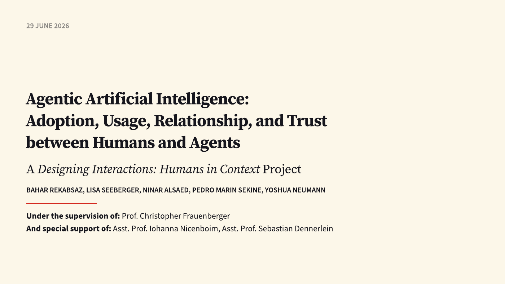
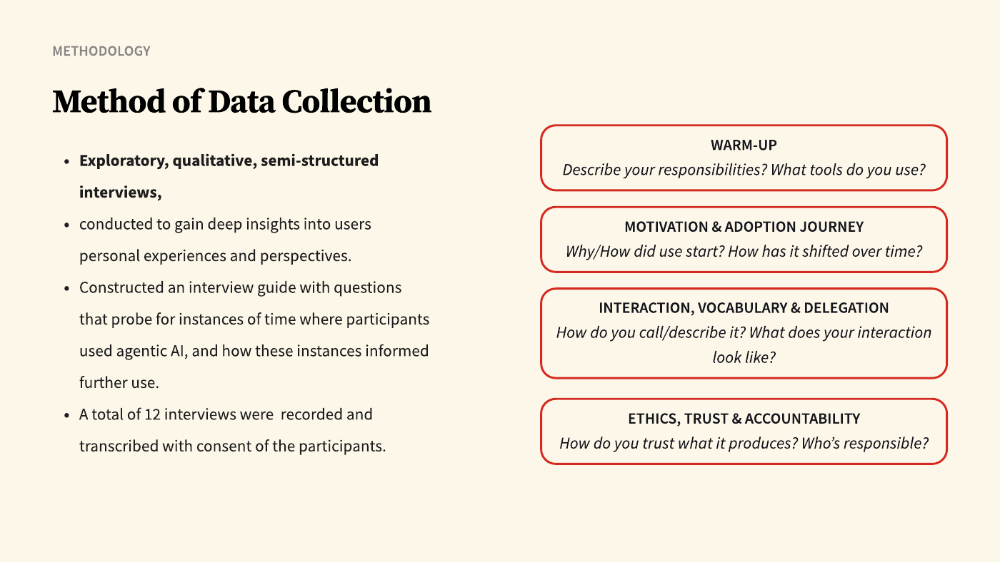
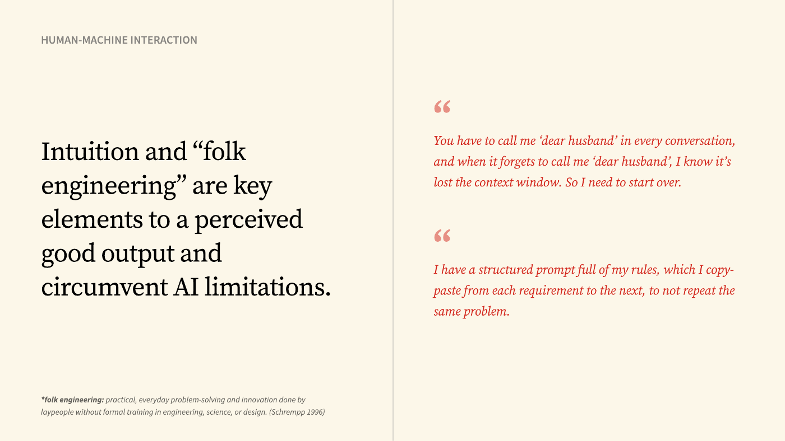

# Working With Agents
**Humans in Context — Designing Interactions Pre-Specialization Project**
IT:U Interdisciplinary Transformation University · MSc Interdisciplinary Computing

---

This repository contains a practitioner playbook for delegating work to agentic AI coding tools — Claude Code, Cursor, Codex, Opencode, and similar. It covers how to brief an agent, how to structure tasks so they stay on track, how to verify output you didn't write, and how to use multiple models together.

**Important caveat:** the practices here were distilled from interviews with people who use agents regularly in their work. They are practitioner heuristics, not empirically validated rules. This playbook has not been measured against other skill sets or approaches to assess whether following it actually improves outcomes. Treat it as a starting point, not a proven methodology — try the guidance, keep what holds up, and revise what doesn't.

---

## What's in here

### `SKILL.md` — The main playbook

The core reference. Covers:

- A five-stage loop for every non-trivial delegation (plan, restate, iterate, verify, own)
- How to set up reusable guardrails and rules files so you're not re-explaining yourself every session
- When agents are a good fit and when they aren't (including the MVP trap)
- Communication habits that move the needle vs. ones that don't

### `references/`

Three focused reference files that go deeper on specific situations:

| File | What it covers |
|---|---|
| `verification.md` | How to actually check agent output — version control as a safety net, reading vs. running, what to do when you don't understand the code |
| `context-and-scope.md` | Working with context windows, clean vs. messy codebases, breaking down large tasks, detecting context overflow |
| `multi-agent.md` | Using multiple agents and models together, agent-as-judge setups, dividing work for review |

---

## How to use it

The `SKILL.md` file is written as a Claude Code skill and can be loaded directly by the agent as a standing reference. If you're using a different tool, read it as a prompt template or rules document and adapt the format to what your tool supports.

For human reading, start with the core loop in `SKILL.md`, then go into whichever reference file matches the problem you're currently hitting.

---

## The research behind it

The playbook is the output of a qualitative study, **"Agentic Artificial Intelligence: Adoption, Usage, Relationship, and Trust between Humans and Agents"**, presented on 29 June 2026. It was not published as a paper; this repository and the final presentation are the record.

**Starting point.** Existing research on agentic AI covers how to define agents, technology adoption, human–AI interaction and delegation/trust, but does not capture well how people actually adopt, experience and delegate work to these tools day to day.

**Research questions**

- **RQ0:** What motivates people to adopt agentic AI, and to keep using it?
- **RQ1:** What is the relationship between the user and the agent: the words they use for it, their workflow, and how the scope and autonomy of what they delegate shift over time?
- **RQ2:** What are the ethical implications: how trust shapes reliance and oversight, what risks come with delegating decisions, and where accountability sits when something goes wrong?

**Method.** Exploratory, semi-structured interviews following a guide in four blocks: warm-up, motivation and adoption journey, interaction/vocabulary/delegation, and ethics/trust/accountability. The analysed sample is nine interviews (six professionals, three students; 24–44 minutes each, via Teams), recorded and transcribed with consent. Interviews were coded iteratively in QualCoder, each reviewed by at least two researchers; codes were grouped into themes individually and then refined together.

**Findings**

1. Continued use and perceived reliability depend on task complexity and on how efficiently the agent gets to done: *"Perfect for the tiny task, but when you ask it something big or something complicated, it's gonna be a nightmare."*
2. The relationship is unstable, swinging between tool and partner: participants called it a *"lucky employee"*, *"a minion"*, and *"just a stupid tool"*.
3. Intuition and "folk engineering" (home-grown rules, copy-pasted prompts, tricks for noticing when context is lost) are what people rely on to get good output and work around limits.
4. Trust is negotiated and conditional, not a function of the agent's competence alone.
5. Responsibility stays firmly human even as autonomy grows: *"You cannot blame your car. You are the driver."*
6. Delegating moves effort from doing the task to overseeing and evaluating it, and some participants pulled back to avoid losing their own skills.

**Implications for design.** Graduated, adjustable autonomy matched to task complexity; agents built so their work can be monitored and validated; and users' folk-engineering practices treated as scaffolding for better explainability. The playbook in this repository turns those findings into a practical delegation workflow.

**Limitations.** Small, mostly male (8 of 9) and mostly professional sample; no longitudinal data; responsibility was asked about in retrospect, not observed in real high-stakes situations; and the tools change fast enough to date the findings.

## Team and context

Bahar Rekabsaz, Lisa Seeberger, Ninar Alsaed, Pedro Marin Sekine, Yoshua Neumann.

Supervised by Prof. Christopher Frauenberger, with support from Asst. Prof. Iohanna Nicenboim and Asst. Prof. Sebastian Dennerlein.

Developed in the **Designing Interactions: Humans in Context** project of the [MSc Interdisciplinary Computing](https://it-u.at/en/study-program/master-programs/) at [IT:U — Interdisciplinary Transformation University Austria](https://it-u.at/en/), Linz, summer term 2026.
